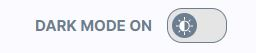
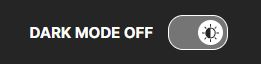
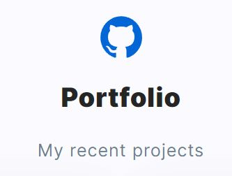
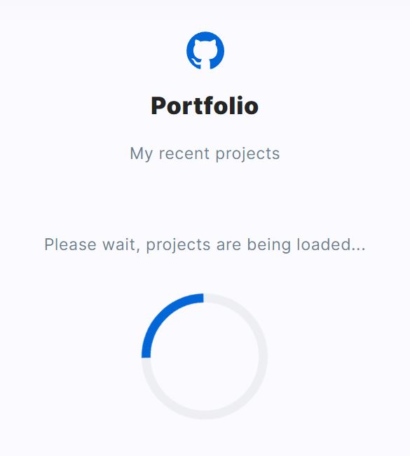
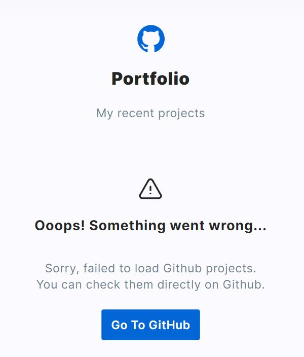

# 📁Personal Homepage - Natalia Mazur-Żurek

This is my Personal Homepage - portfolio of my recent projects. 
## 📌Demo:
Feel free to see it!👁‍🗨

[Personal Homepage - Natalia Mazur-Żurek](https://maxnatalia.github.io/personal-homepage/) 

## 📌General Information

This project was bootstrapped with Create React App, using the Redux and Redux Toolkit template.

Read about me and make a hiring decision. If it's night - turn on the dark mode!

The purpose of creating this project was to improve my programming skills and showing my skills in a clear way.

### 📎Features
- Switching between light and dark theme.

- Downloading projects directly from my GitHub

- Loading animation while downloading data

- Error handled

## 🛠Used technologies:
- [x] HTML
- [x] CSS (Flex, Grid)
- [x] JavaScript ES6+
- [x] MediaQueries
- [x] React
- [x] React hooks
- [x] Redux
- [x] Styled-components
- [x] Visual project from Figma
- [x] Downloading data from API
## Available Scripts

In the project directory, you can run:

### `npm start`

Runs the app in the development mode.\
Open [http://localhost:3000](http://localhost:3000) to view it in your browser.

The page will reload when you make changes.\
You may also see any lint errors in the console.
### `npm run build`

Builds the app for production to the `build` folder.\
It correctly bundles React in production mode and optimizes the build for the best performance.

The build is minified and the filenames include the hashes.\
Your app is ready to be deployed!

See the section about [deployment](https://facebook.github.io/create-react-app/docs/deployment) for more information.
